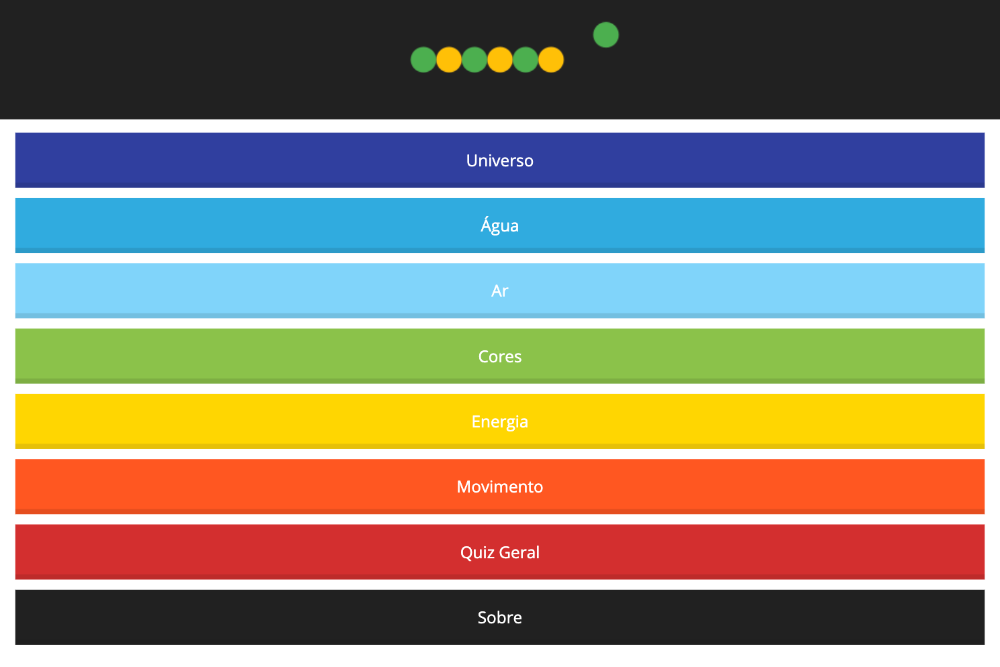

# [2017] Física Para Todos [Assets]

Repositório com os assets do projeto de extensão "Física para todos", que tem como objetivo usar as TICs no apoio ao ensino de matemática básica para crianças nas séries iniciais.

Acesse a página interativa do projeto [**clicando aqui**](https://vitutiv.github.io/fisica-para-todos-assets/).

Este projeto foi apoiado pelo Instituto Federal de Educação Ciência e Tecnologia da Bahia, Campus Jacobina.
